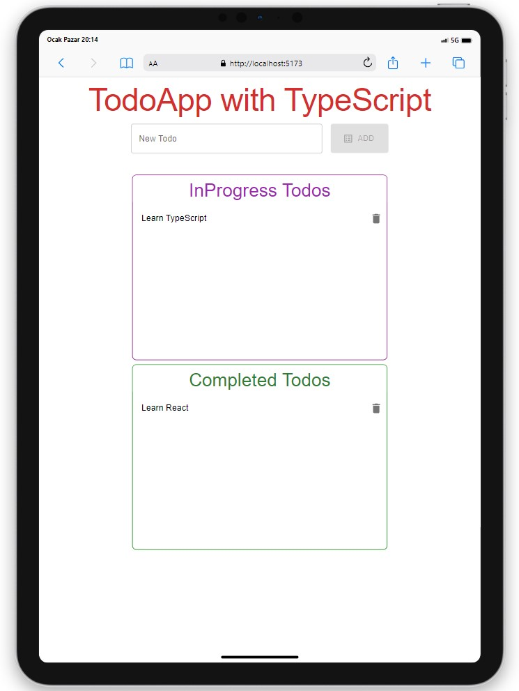

# Todo App

<div align="center">
  
</div>

## About the Project

This project, which I created using Vite-React-TypeScript, includes a to-do list application where users can add and delete tasks.

## Table of Contents

- [Technologies Used](#technologies-used)
- [Usage](#usage)
- [Project Skeleton](#project-skeleton)
- [Screenshots](#screenshots)

## Live Demo

[Todo App]()


## Technologies Used

- React
- TypeScript
- Vite
- Axios for API requests
- Styling with [Material UI](https://mui.com/)
- [Sweetalert2](https://sweetalert2.github.io/) for alert 
- [Mockapi](https://mockapi.io//) for API 

## Usage

- Type your task in the input section to add a new task.
- Click the "ADD" button after entering your task.
- When you have completed a task, you can click on the completed task and move it to the completed section or send it back to the to-do section.
- You can delete a task by clicking on the trash bin icon.

## Project Skeleton

```     
SOLUTION
├── src
│    ├── App.tsx
│    ├── main.tsx
│    ├── assets
│    ├── components
│    │   ├── AddTodo.tsx
│    │   ├── Items.tsx
│    │   └── TodoList.tsx
│    ├── pages
│    │   └── Home.tsx
│    ├── helper
│    │   └── sweetalert.ts
│    ├── types.d.ts
│    └── vite-env.d.ts
├── package.json
├── index.html
├── .gitignore
├── README.md
├── vite.config.ts
├── tsconfig.node.json
├── tsconfig.json
└── pnpm-lock.yaml
```

## Screenshots

<div align="center">
  
  
  
</div>

## Compatibility

The project is compatible with both wide-screen computers and mobile devices.